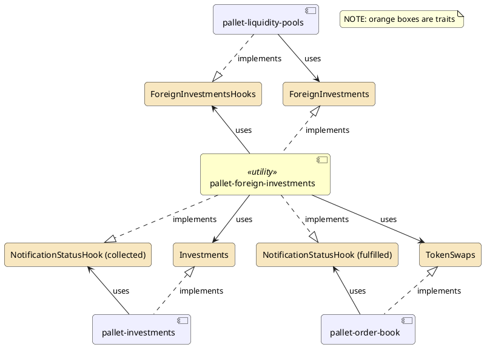
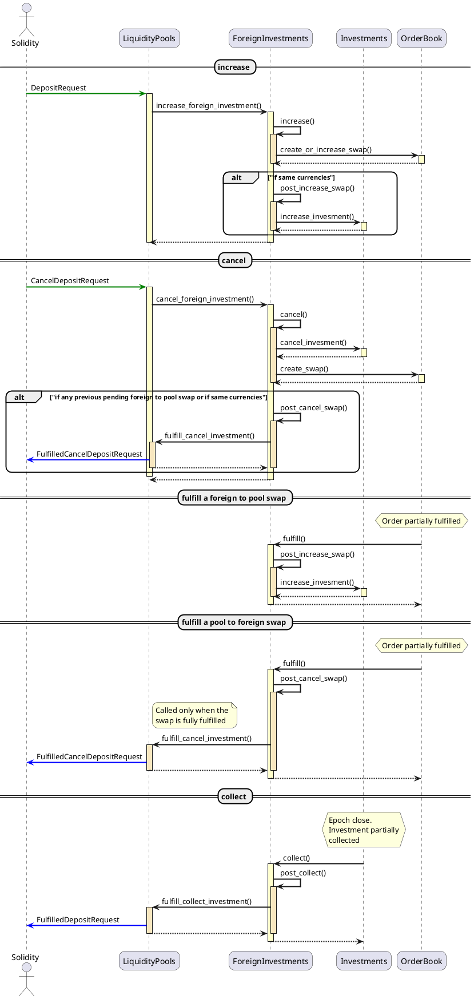
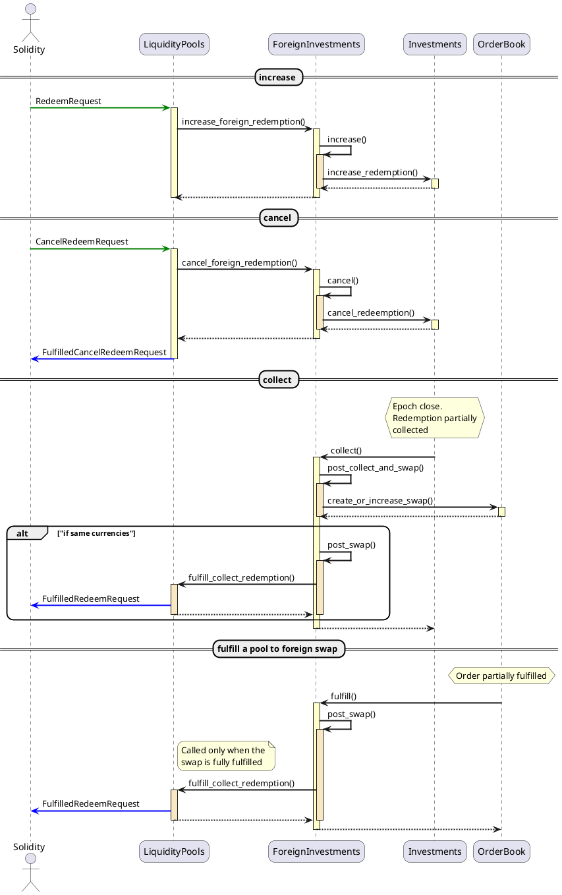

# Foreign Investments (diagrams)

## Architecture
`pallet-foreign-investment` is a pallet without extrinsics that acts as a glue connecting investments and orders to liquidity pools though a bunch of traits:

## Actions
The following diagrams shows the sequence from the `pallet-foreign-investments` point of view and which LP messages are sent/received.

### Investments

### Redemptions

