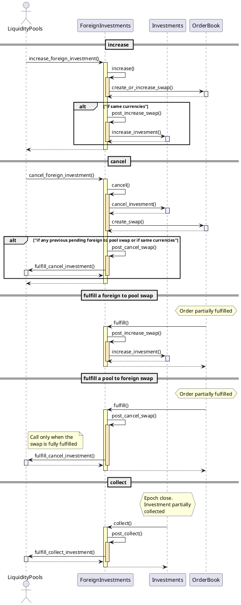
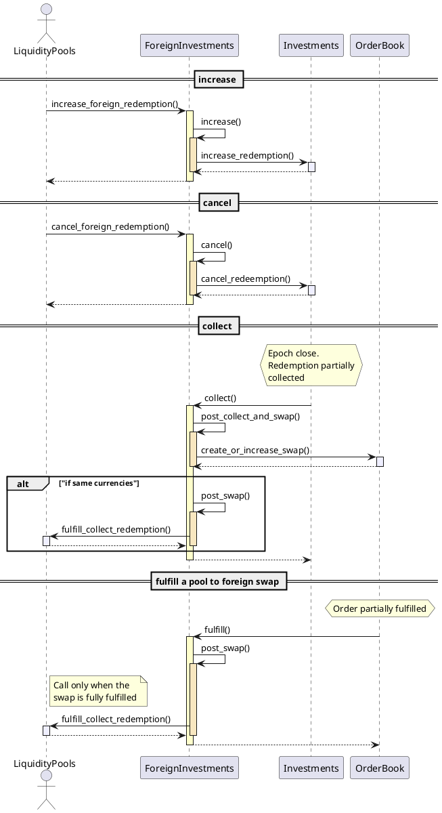

The following diagrams shows the sequence from the `pallet-foreign-investments` point of view.

### Investments

```plantuml
@startuml

actor LiquidityPools as LP
participant ForeignInvestments as FI
participant Investments
participant OrderBook

== increase ==
LP -> FI ++ #Business : increase_foreign_investment()
FI -> FI : increase()
activate FI #Strategy
FI -> OrderBook ++ #Motivation : create_or_increase_swap()
FI <-- OrderBook --
deactivate FI
alt "if same currencies"
    FI -> FI : post_increase_swap()
    activate FI #Strategy
    FI -> Investments ++ #Motivation : increase_invesment()
    FI <-- Investments --
    deactivate FI
end
LP <-- FI --

== cancel ==
LP -> FI ++ #Business : cancel_foreign_investment()
FI -> FI : cancel()
activate FI #Strategy
FI -> Investments ++ #Motivation : cancel_invesment()
FI <-- Investments --
FI -> OrderBook ++ #Motivation : create_swap()
FI <-- OrderBook --
deactivate FI
alt "if any previous pending foreign to pool swap or if same currencies"
    FI -> FI : post_cancel_swap()
    activate FI #Strategy
    LP <- FI ++ #Motivation : fulfill_cancel_investment()
    LP --> FI --
    deactivate FI
end
LP <-- FI --

== fulfill a foreign to pool swap ==
hnote over OrderBook : Order partially fulfilled
FI <- OrderBook ++ #Business : fulfill()
FI -> FI : post_increase_swap()
activate FI #Strategy
FI -> Investments ++ #Motivation : increase_invesment()
FI <-- Investments --
deactivate FI
FI --> OrderBook --

== fulfill a pool to foreign swap ==
hnote over OrderBook : Order partially fulfilled
FI <- OrderBook ++ #Business : fulfill()
FI -> FI : post_cancel_swap()
activate FI #Strategy
note right of LP : Call only when the\nswap is fully fulfilled
LP <- FI ++ #Motivation : fulfill_cancel_investment()
LP --> FI --
deactivate FI
FI --> OrderBook --

== collect ==
hnote over Investments : Epoch close.\nInvestment partially\ncollected
FI <- Investments ++ #Business : collect()
FI -> FI : post_collect()
activate FI #Strategy
LP <- FI ++ #Motivation : fulfill_collect_investment()
LP --> FI --
deactivate FI
FI --> Investments --

@enduml
```

### Redemptions

```plantuml
@startuml

actor LiquidityPools as LP
participant ForeignInvestments as FI
participant Investments
participant OrderBook

== increase ==
LP -> FI ++ #Business : increase_foreign_redemption()
FI -> FI : increase()
activate FI #Strategy
FI -> Investments ++ #Motivation : increase_redemption()
FI <-- Investments --
deactivate FI
LP <-- FI --

== cancel ==
LP -> FI ++ #Business : cancel_foreign_redemption()
FI -> FI : cancel()
activate FI #Strategy
FI -> Investments ++ #Motivation : cancel_redeemption()
FI <-- Investments --
deactivate FI
LP <-- FI --

== collect ==
hnote over Investments : Epoch close.\nRedemption partially\ncollected
FI <- Investments ++ #Business : collect()
FI -> FI : post_collect_and_swap()
activate FI #Strategy
FI -> OrderBook ++ #Motivation : create_or_increase_swap()
FI <-- OrderBook --
deactivate FI

alt "if same currencies"
    FI -> FI : post_swap()
    activate FI #Strategy
    LP <- FI ++ #Motivation : fulfill_collect_redemption()
    LP --> FI --
    deactivate FI
end

FI --> Investments --

== fulfill a pool to foreign swap ==
hnote over OrderBook : Order partially fulfilled
FI <- OrderBook ++ #Business : fulfill()
FI -> FI : post_swap()
activate FI #Strategy
note right of LP : Call only when the\nswap is fully fulfilled
LP <- FI ++ #Motivation : fulfill_collect_redemption()
LP --> FI --
deactivate FI
FI --> OrderBook --


@enduml
```
