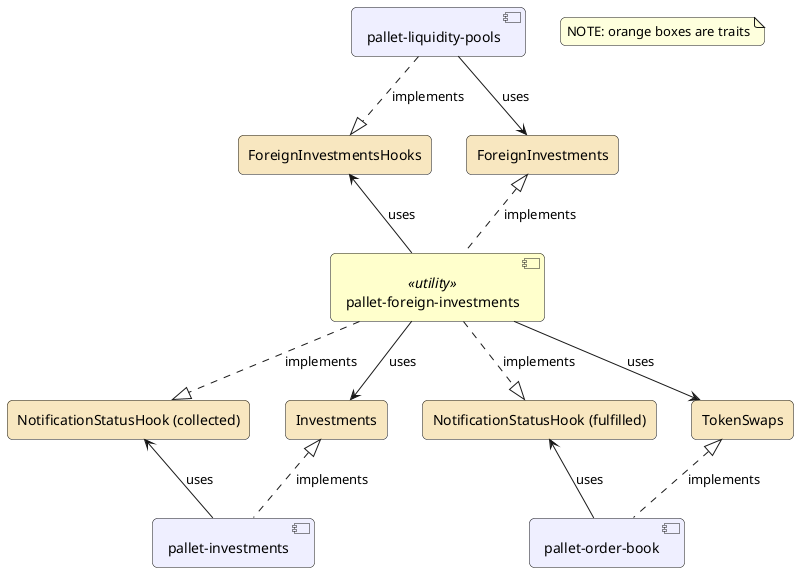
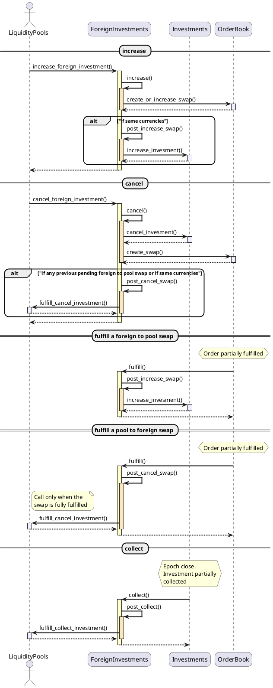
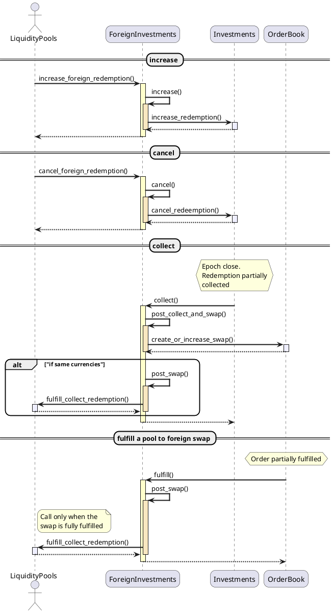

# Foreign Investments (diagrams)

## Architecture
`pallet-foreign-investment` is a pallet without extrinsics that acts as a glue connecting investments and orders to liquidity pools though a bunch of traits:

## Actions
The following diagrams shows the sequence from the `pallet-foreign-investments` point of view.

### Investments

### Redemptions

### Miscelaneous
- Pallet color used: [here]( https://www.plantuml.com/plantuml/uml/LP312i8m38RlUuf2Ny09tgUUF0Y2WkUmXQsiJKkJ2Njx9rirvlRz-KX26XR8CWLVyUWeGOPWWgEp1-QdwsGmzVwWUXGxP4octgam0urRM6Li1QZtQ8ufUTU2k4XcAQjOMQU97I6pMSiMLieb98y1ITPPzf-LU8tYNj-5nlvOIRTXvkKCNnOMLifTCWZsSr4AA-M1xK3HnqsoFwuQfExpq3S0)
