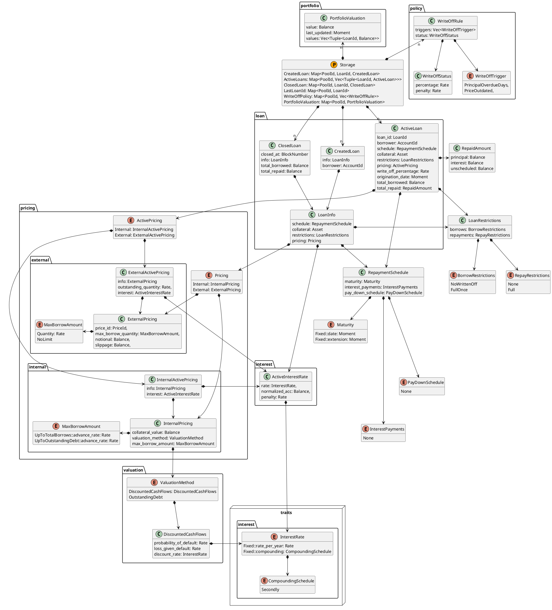

```plantuml
@startuml

set namespaceSeparator ::
hide methods

enum Maturity {
    Fixed::date: Moment
    Fixed::extension: Moment
}

enum InterestPayments {
    None
}

enum PayDownSchedule {
    None
}

class RepaymentSchedule {
    maturity: Maturity
    interest_payments: InterestPayments
    pay_down_schedule: PayDownSchedule
}

RepaymentSchedule *--> Maturity
RepaymentSchedule *---> PayDownSchedule
RepaymentSchedule *----> InterestPayments

enum BorrowRestrictions {
    NoWrittenOff
    FullOnce
}

enum RepayRestrictions {
    None
    Full
}

class LoanRestrictions {
    borrows: BorrowRestrictions
    repayments: RepayRestrictions
}

LoanRestrictions *--> BorrowRestrictions
LoanRestrictions *--> RepayRestrictions

class RepaidAmount {
    principal: Balance
    interest: Balance
    unscheduled: Balance
}

node traits {
    package interest {
        enum CompoundingSchedule {
            Secondly
        }

        enum InterestRate {
            Fixed::rate_per_year: Rate
            Fixed::compounding: CompoundingSchedule
        }

        InterestRate *--> CompoundingSchedule
    }
}

package portfolio {
    class PortfolioValuation {
        value: Balance
        last_updated: Moment
        values: Vec<Tuple<LoanId, Balance>>
    }
}

package valuation {
    class DiscountedCashFlows {
        probability_of_default: Rate
        loss_given_default: Rate
        discount_rate: InterestRate
    }

    DiscountedCashFlows *-r-> InterestRate

    enum ValuationMethod {
        DiscountedCashFlows: DiscountedCashFlows
        OutstandingDebt
    }

    ValuationMethod *--> DiscountedCashFlows
}

package policy {
    class WriteOffStatus {
        percentage: Rate
        penalty: Rate
    }

    enum WriteOffTrigger {
        PrincipalOverdueDays,
        PriceOutdated,
    }

    class WriteOffRule {
        triggers: Vec<WriteOffTrigger>
        status: WriteOffStatus
    }

    WriteOffRule *--> WriteOffTrigger
    WriteOffRule *--> WriteOffStatus
}

package interest {
    class ActiveInterestRate {
        rate: InterestRate,
        normalized_acc: Balance,
        penalty: Rate
    }

    ActiveInterestRate *--> InterestRate
}

package pricing {
    package internal {
        enum MaxBorrowAmount {
            UpToTotalBorrows::advance_rate: Rate
            UpToOutstandingDebt::advance_rate: Rate
        }

        class InternalPricing {
            collateral_value: Balance
            valuation_method: ValuationMethod
            max_borrow_amount: MaxBorrowAmount
        }

        InternalPricing *-l-> MaxBorrowAmount
        InternalPricing *-d-> valuation::ValuationMethod

        class InternalActivePricing {
            info: InternalPricing
            interest: ActiveInterestRate
        }

        InternalActivePricing *-r-> ActiveInterestRate
        InternalActivePricing *--> InternalPricing
    }

    package external {
        enum MaxBorrowAmount {
            Quantity: Rate
            NoLimit
        }

        class ExternalPricing {
            price_id: PriceId,
            max_borrow_quantity: MaxBorrowAmount,
            notional: Balance,
            slippage: Balance,
        }

        ExternalPricing *-l-> MaxBorrowAmount

        class ExternalActivePricing {
            info: ExternalPricing
            outstanding_quantity: Rate,
            interest: ActiveInterestRate
        }

        ExternalActivePricing *-r-> ActiveInterestRate
        ExternalActivePricing *--> ExternalPricing
    }

    enum Pricing {
        Internal: InternalPricing
        External: ExternalPricing
    }

    enum ActivePricing {
        Internal: InternalActivePricing
        External: ExternalActivePricing
    }

    Pricing *--> InternalPricing
    Pricing *--> ExternalPricing

    ActivePricing *----> InternalActivePricing
    ActivePricing *--> ExternalActivePricing
}

package loan {
    class LoanInfo {
        schedule: RepaymentSchedule
        collateral: Asset
        restrictions: LoanRestrictions
        pricing: Pricing
    }

    class CreatedLoan {
        info: LoanInfo
        borrower: AccountId
    }

    class ActiveLoan {
        loan_id: LoanId
        borrower: AccountId
        schedule: RepaymentSchedule
        collateral: Asset
        restrictions: LoanRestrictions
        pricing: ActivePricing
        write_off_percentage: Rate
        origination_date: Moment
        total_borrowed: Balance
        total_repaid: RepaidAmount
    }

    class ClosedLoan {
        closed_at: BlockNumber
        info: LoanInfo
        total_borrowed: Balance
        total_repaid: Balance
    }

    LoanInfo *--> RepaymentSchedule
    LoanInfo *-r-> LoanRestrictions
    LoanInfo *--> pricing::Pricing
    LoanInfo *--> ActiveInterestRate

    CreatedLoan *--> LoanInfo

    ActiveLoan *--> pricing::ActivePricing
    ActiveLoan *-d--> RepaymentSchedule
    ActiveLoan *-r-> LoanRestrictions
    ActiveLoan *-r-> RepaidAmount

    ClosedLoan *--> LoanInfo
}

class Storage <<(P, orange)>> {
    CreatedLoan: Map<PoolId, LoanId, CreatedLoan>
    ActiveLoans: Map<PoolId, Vec<Tuple<LoanId, ActiveLoan>>>
    ClosedLoan: Map<PoolId, LoanId, ClosedLoan>
    LastLoanId: Map<PoolId, LoanId>
    WriteOffPolicy: Map<PoolId, Vec<WriteOffRule>>
    PortfolioValuation: Map<PoolId, PortfolioValuation>
}

Storage *--> "n" CreatedLoan
Storage *--> "n" ActiveLoan
Storage *--> "n" ClosedLoan
Storage *-u-> "n" WriteOffRule
Storage *-u-> "n" PortfolioValuation

@enduml
```
