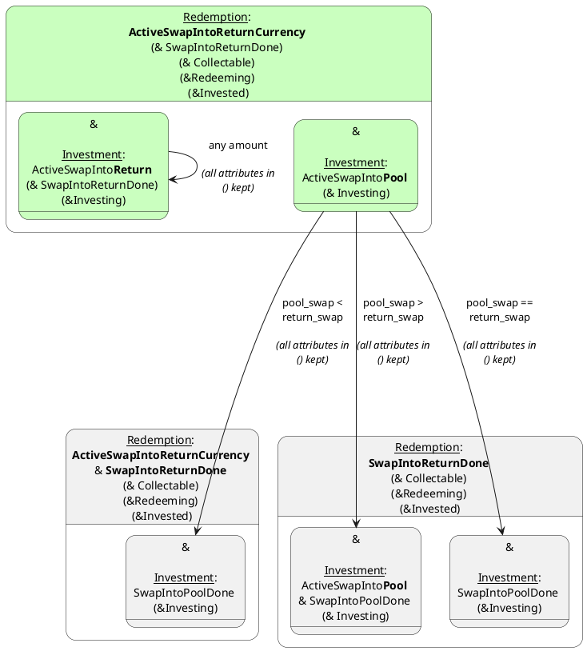

```plantuml
@startuml
skinparam maxMessageSize 100

state Redemption_Swap as "<u>Redemption</u>: \n<b>ActiveSwapIntoReturnCurrency</b> \n(& SwapIntoReturnDone) \n(& Collectable) \n(&Redeeming) \n(&Invested)" #CAFFBF {
    state SwapR__Invest_SwapPool as "&\n\n <u>Investment</u>: \nActiveSwapInto<b>Pool</b> \n(& Investing)" #CAFFBF
    state SwapR__Invest_SwapReturn as "&\n\n <u>Investment</u>: \nActiveSwapInto<b>Return</b> \n(& SwapIntoReturnDone) \n(&Investing)" #CAFFBF
}

state Redemption_Swap_DoneReturn as "<u>Redemption</u>: \n<b>ActiveSwapIntoReturnCurrency</b> \n& <b>SwapIntoReturnDone</b> \n(& Collectable) \n(&Redeeming) \n(&Invested)" {
    state SwapR__Invest_DonePool as "&\n\n <u>Investment</u>: \nSwapIntoPoolDone \n(&Investing)"
}

state RedemptionNoSwap as "<u>Redemption</u>: \n<b>SwapIntoReturnDone</b> \n(& Collectable) \n(&Redeeming) \n(&Invested)" {
    state NoSwapR__Invest_SwapPool_DonePool as "&\n\n <u>Investment</u>: \nActiveSwapInto<b>Pool</b> \n& SwapIntoPoolDone \n(& Investing)"
    state NoSwapR__Invest_DonePool as "&\n\n <u>Investment</u>: \nSwapIntoPoolDone \n(&Investing)"
}

SwapR__Invest_SwapPool ----> NoSwapR__Invest_SwapPool_DonePool : pool_swap > return_swap \n\n<i>(all attributes in () kept)</i>
SwapR__Invest_SwapPool ----> NoSwapR__Invest_DonePool : pool_swap == return_swap \n\n<i>(all attributes in () kept)</i>
SwapR__Invest_SwapPool ----> SwapR__Invest_DonePool : pool_swap < return_swap \n\n<i>(all attributes in () kept)</i>

SwapR__Invest_SwapReturn --> SwapR__Invest_SwapReturn : any amount \n\n<i>(all attributes in () kept)</i>

@enduml
```